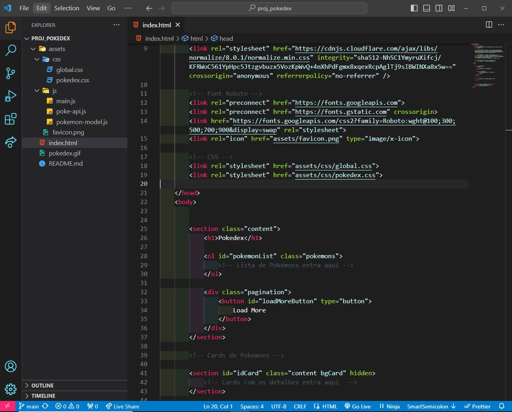
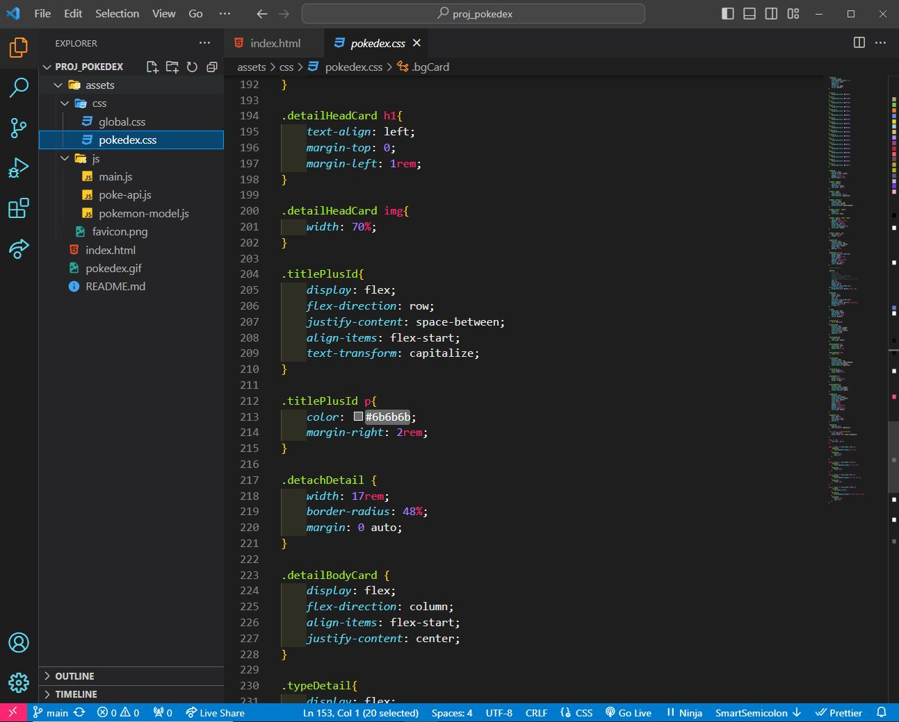
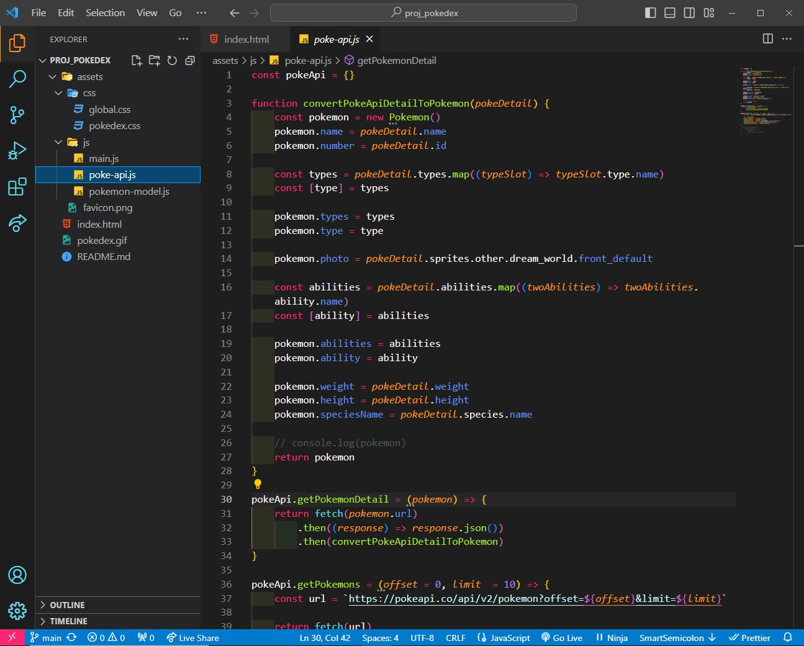

# My Own Monokai - Seu Tema Personalizado para o Visual Studio Code

HTML

CSS

JS

Eu sou um grande fã do tema Monokai para o Visual Studio Code, mas sempre senti que havia áreas onde poderia ser aprimorado. Decidi criar minha própria versão personalizada do Monokai, que chamei de 'My Own Monokai'. Este tema é uma interpretação refinada do Monokai, adaptada às minhas preferências e estilo de codificação.

Agora, estou animado em compartilhar meu tema 'My Own Monokai' com a comunidade do VS Code. Ele apresenta uma paleta de cores cuidadosamente selecionada que aprimora a legibilidade e oferece uma experiência de codificação agradável. Se você também é um fã do Monokai, ou está apenas em busca de um novo tema visualmente atraente, sinta-se à vontade para experimentar 'My Own Monokai'. Basta procurar por ele na extensão do Visual Studio Code para obter mais detalhes e instruções de instalação.

Espero que meu tema aprimorado torne sua experiência de programação no Visual Studio Code ainda mais agradável. Fique à vontade para deixar feedback e sugestões para futuras melhorias. Aproveite e feliz codificação!

